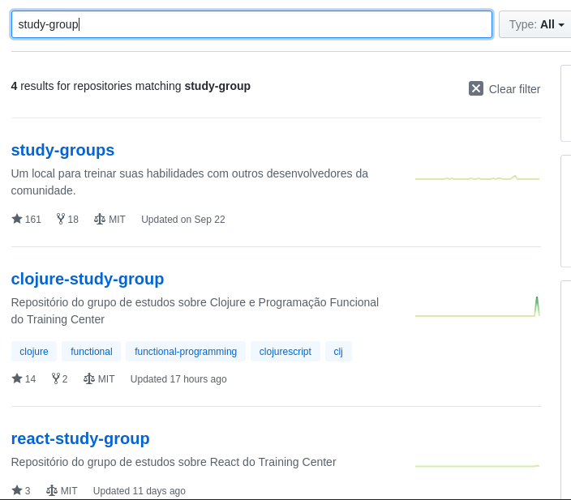

# study-groups 📖

Projeto voltado para pessoas que desejam **montar um grupo de estudos** para aprender em conjunto ou compartilhar seu conhecimento.

<!-- TOC depthFrom:1 depthTo:6 withLinks:1 updateOnSave:1 orderedList:0 -->

- [study-groups 📖](#study-groups-)
	- [O que é o study-groups](#o-que-o-study-groups)
	- [Por que criar um grupo de estudos](#por-que-criar-um-grupo-de-estudos)
	- [Como funciona](#como-funciona)
	- [O que é preciso para nascer um grupo de estudos](#o-que-preciso-para-nascer-um-grupo-de-estudos)
	- [Criando o repositório do grupo](#criando-o-repositrio-do-grupo)
	- [Como funcionam os estudos](#como-funcionam-os-estudos)
	- [Como participar de algum grupo já existente](#como-participar-de-algum-grupo-j-existente)
	- [Uma pessoa do grupo sumiu](#uma-pessoa-do-grupo-sumiu)
	- [Já aprendi de tudo, agora quero ir para o mercado de trabalho](#j-aprendi-de-tudo-agora-quero-ir-para-o-mercado-de-trabalho)

<!-- /TOC -->

## O que é o study-groups

O study-groups é uma iniciativa do [Training Center](https://training-center.github.io/) para juntar pessoas que tem vontade de aprender algo em comum, como PHP, Ruby, Nodejs, Java, C#, Android, iOS, UX, UI, front, back, etc.

Estas pessoas irão se organizar para criar um roadmap de estudos do que elas sentem necessidade de estudar e seguir esse roadmap. Também serão responsáveis por organizar reuiões, fazer hangouts ou qualquer outro modo para se encontrarem e compartilharem o que aprenderam.

Será necessário utilizar o Git e o GitHub. Porém estamos aqui para te ajudar com isso caso você não saiba utilizar essas ferramentas.

Se você quiser ainda pode fazer este curso gratuito do [@willianjusten](https://github.com/willianjusten): [Git e GitHub para iniciantes](https://www.udemy.com/git-e-github-para-iniciantes/).

## Por que criar um grupo de estudos

As pessoas se sentem mais motivadas quando estão em grupo fazendo algo em comum.

Como quando você quer praticar algum esporte e sente mais motivação quando tem outras pessoas fazendo o mesmo.

[Aristóteles: por que vivemos coletivamente?](http://www.tribunapr.com.br/noticias/aristoteles-por-que-vivemos-coletivamente/).

Você pode criar um grupo para se motivar a estudar ou para ajudar outras pessoas que precisam.

## Como funciona

O fluxo da criação e organização de um grupo de estudos é:

- uma pessoa deve abrir uma issue informando que deseja criar um grupo de estudos
- esta pessoa deve divulgar a issue em nosso [Slack](https://github.com/training-center/slack) no canal `#general`
- as pessoas interessadas no grupo de estudos entrarão em contato seja pela issue ou pela **thread** aberta no `#general` e o grupo irá começar a se formar
- assim que tiver mais de 5 pessoas deve-se avisar alguma das pessoas da organização (contatos abaixo) para que criem o canal do grupo de estudos
- o próprio grupo deve definir o que e como vai estudar (um roadmap de estudos)
- a pessoa que ficou responsável pelo grupo deverá criar um repositório ([como criar o repositório](https://github.com/training-center/study-groups#criando-o-repositório-do-grupo)) com informações e o roadmap do grupo
- a pessoa que ficou responsável pelo grupo deverá manter o repositório atualizado e o canal no Slack organizado

Para chamar as pessoas responsáveis pela org para a criação do canal do grupo de estudos você deve digitar `@core` na thread da formação do grupo de estudos.

Caso não tenha sido definido através de uma thread, basta chamar qualquer uma destas pessoas:

`@woliveiras @fernandabernardo @adeonir @alinebastos @lhs.santoss @akfzambrana @patota @bertelledani @paulodiniz @jamilelima @leandro.bighetti @marcelabomfim @lflimeira`

## O que é preciso para nascer um grupo de estudos

Tudo o que é necessário é uma pessoa (ou mais pessoas) que possa ficar responsável por direcionar o grupo e pelo menos 5 pessoas para estudarem juntas.

Direcionar aqui **não é ensinar**. Você não precisa ser expert em uma coisa para criar um grupo de estudos sobre ela. Direcionar, em nosso contexto, é manter o grupo organizado, adicionar as pautas e atas de reuniões repositório do grupo e manter o repositório do grupo atualizado.

Ex.:

- [Grupo de estudos PHP OOP](https://github.com/training-center/Grupo-de-Estudos-PHP-POO)
- [Clojure study group](https://github.com/training-center/clojure-study-group)

Esta pessoa também será responsável por manter o canal do grupo em nosso Slack organizado.

## Criando o repositório do grupo

Para criar o repositório basta usar este [template](https://github.com/training-center/template-study-group).

## Como funcionam os estudos

Os grupos devem se organizar **entre eles** para combinar horários de estudos, conteúdo a ser estudado, formato de estudos, etc. Está tudo em suas mãos!

**Dica**

**Uma boa maneira de estudar é:** Cada semana um membro do grupo de estudos junta o máximo de informações sobre um assunto e transmite para a galera.

Alguns materiais de estudo podem ser encontrados [aqui](github/material-de-apoio.md)([em construção], você pode ajudar).

Vocês podem criar projetos juntos e, dependendo do projeto que quiserem criar, podem juntar outros grupos para trabalhar em conjunto.

*Ex.:* Juntar a galera de Front para montar o Client Side, galera de Back para fazer as API's, galera de Mobile para criar App's consumindo essas API's.

## Como participar de algum grupo já existente

Você deve entrar em nossa página no GitHub e procurar por `study-group`, todos os grupos existentes serão listados, então é só procurar as pessoas responsáveis pelos grupos (que estarão listadas no repositório do grupo).

  

## Uma pessoa do grupo sumiu

Não fique sem estudar por isso.

Convide outra pessoa para participar.

## Já aprendi de tudo, agora quero ir para o mercado de trabalho

Você pode utilizar nossos recursos para procurar seu primeiro emprego ou direcionamento de carreira:

- [primeiro-trampo](https://github.com/training-center/primeiro-trampo)
- [mentoria](https://github.com/training-center/mentoria)

---

Todo conhecimento deveria ser compartilhado.

Devemos aprender, praticar e ensinar. Esse é o ciclo para aprendermos sempre mais.

Um agradecimento especial ao [Diego Brocanelli](https://github.com/Diego-Brocanelli) que ajudou a montar o novo fluxo do study-groups.
